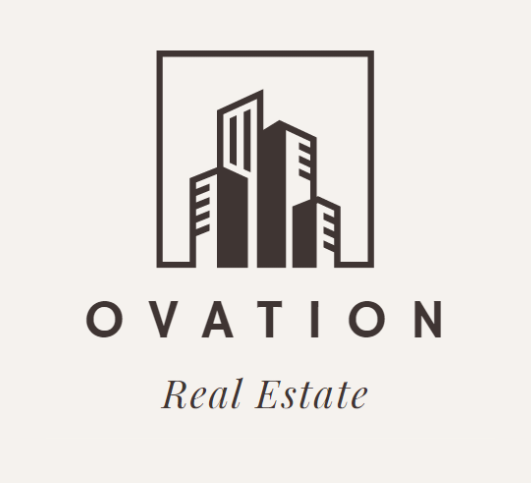
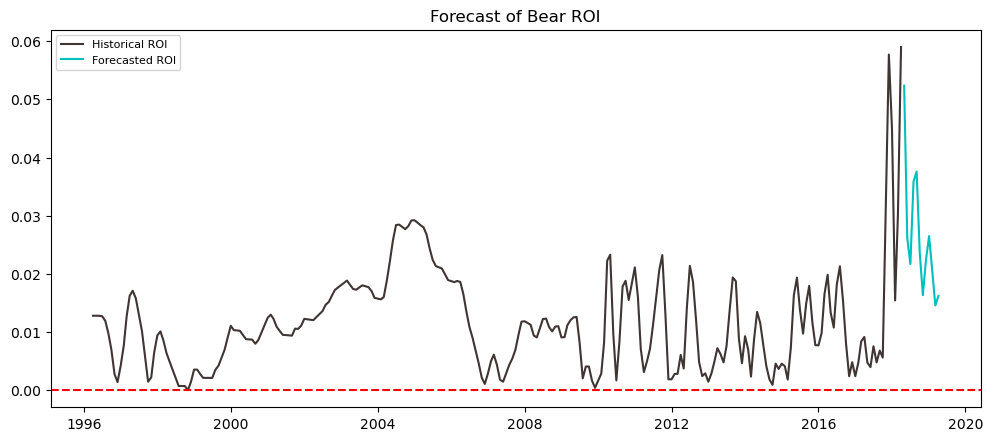
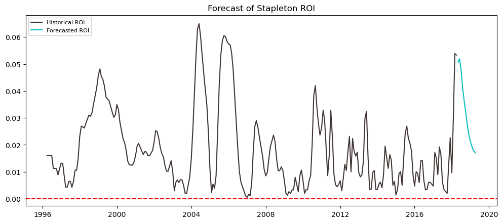

# phase_4_project
Timi, Brian, Tim's phase 4 Flatiron Project

# LOCATION FORECASTING USING TIME SERIES FORECASTING




## STAKEHOLDER AND BUSINESS UNDERSTANDING 
Our firm, BTT Consulting has been hired by a real estate property company, OVATION REAL ESTATE. They are looking to invest in five(5) new locations 
around the country. They want locations that assure them of immediate profitability and return on investment. We are focusing on the average return on investment of properties to arrive at our recommended locations.

## DATA  &  DATA ANALYSIS
We are making use of Zillow Research data sourced from the Zillow website. The dataset encompasses mean monthly property values in close to 15,000 
zip codes spread around the country from April, 1996 up to April, 2018. We aggregated the data by quarter to arrive at the return on investment (ROI) over 
each quarter. Making use of quarterly Returns on Investment, we were able to arrive at first, the state with the highest ROI, then we narrowed it down to 
metro, county and finally the best performing cities.  

## MODELING
We carried out the bulk of our analyses using Time Series forecasting. 

### Baseline Model
Our baseline model was a Naive Forecast, which was merely a carry-over of the current values of property into the next quarter. This model assumes all
conditions remain constant; that the present mean values we had in our dataset will remain unchanged over the next fiscal quarter. Using Root Mean Square error as our metric of choice, we had a value of 0.0103 (1.03%) variation in ROI for this model. This model did not satisfy our questions concerning volatility in the real estate market.


### First Model
The first model is an ARIMA model(incorporating Walk-forward modeling). Using the most recent ROIs we ran a forecast to have an idea of the expected ROIs on the cities in our dataset over the next financial quarter. This model takes into consideration the property values in previous lags (times periods) and trends or seasonality effects over the same periods. Of note is the 2008 Housing Bust which could potentially distort the forecast of the best designed model. We arrived at Delaware as the state with the highest ROI, New Castle County and the five best performing cities in the county as potential locations of choice. This model had an RMSE of 0.00725 (~0.73%) variation in ROI. While this model is significantly more reliable than the baseline model, we designed a second to overcome any shortcomings we had with city selection in this model.


### Second Model
This model uses a tiered system to pick locations. The highest valued projected ROI for the next quarter of 5% in Stapleton is higher than our previous model's estimation in Bear. The underlying model itself is the same as model 1, so we expect the RMSE of this model to be approximately the same as the first model. For future models of this type we would like to try an auto-arima model function that varies the hyperparameters as needed for each iteration of the model itself. We expect a model run this way to be more accurate with its results but we do not expect the resulting outcome to change significantly. We could not adopt the results of this model because it came in late.



## Conclusions:
In conclusion, we are recommending the following:
- With the highest ROI of all the states, we are recommending setting up in Delaware
- Our model forecasted the New Castle county as having the highest sustained ROI over the next fiscal quarter
- We recommend the following 5 cities having the highest ROIs in New Castle county: 
     - Bear (~3.1% ROI)
     - Claymont (~1.0% ROI)
     - Newport (~0.9% ROI)
     - Wilmington (~0.7% ROI), and 
     - New Castle (~0.6% ROI)

## Future Considerations:
Looking forward, we would like to incorporate the following into our model as we feel these can give us some more insight:
- The market volume 
- Operating costs and overheads
- Using the second model or recommended third model with autoarima methods.

## File Structure
```
.
├── 00_Source_Data                                # Original Source Data Folder
│   └── zillow_data.csv
├── Data                                          # Modified (cleaned) Data Folder
│   ├── Cities.csv
│   ├── Counties.csv
│   ├── Metros.csv
│   ├── States.csv
│   └── Zips.csv
├── Deliverables                                  # PDF of both our Notebook and our Presentation
│   ├── Final_Notebook.pdf
│   └── Presentation.pdf
├── Figures                                       # Images generated and used for Presentation
│   ├── 178b9290b3d3016ae511d862d0620987.png
│   ├── model1_Bear_ROI.png
│   ├── model1_Claymont_ROI.png
│   ├── model1_New Castle_ROI.png
│   ├── model1_Newport_ROI.png
│   ├── model1_Wilmington_ROI.png
│   ├── model2_Fairhope_ROI.png
│   ├── model2_Foley_ROI.png
│   ├── model2_Logan_ROI.png
│   ├── model2_Port Saint Joe_ROI.png
│   └── model2_Stapleton_ROI.png
├── Notebooks                                     # Jupyter Notebook containing our work
│   ├── src
├──── timeseries_project.py
│   ├── Initial_EDA.ipynb
│   └── ROI Analysis.ipynb
├── .gitignore
└── README.md
```
